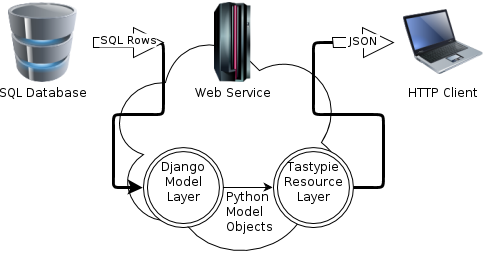

[Tastypie](http://tastypieapi.org/) is a [Django](https://www.djangoproject.com/)-based framework for building a REST API.
It is most effective as a direct wrapper on Django models, resulting in extremely concise code to expose models
as REST resources (using the now-standard terminology where _resource_ means a collection of similar objects). This broad
overview can be diagramed something like the following.

But Tastypie is applicable even for more complex REST API designs, using non-Django data sources, or doing elaborate
things to the Django models before sending them back to the client. These many extension points are provided
as methods to override in the `tastypie.resources.Resource` class. There are enough similarly named methods (`get_list`,
`obj_get_list`, `get_object_list`, ...) that you may have a hard time
figuring out where you need to plug in, like these folks:

 * [Interface for Resource to override methods?](https://groups.google.com/forum/?fromgroups=#!msg/django-tastypie/tw-6nQXOTag/K0PG8_OrbXwJ)
 * [Tastypie Advanced Filtering: Complex lookups with Q objects](https://groups.google.com/forum/?fromgroups=#!topic/django-tastypie/YPghf0rJZqc)
 * [Need help on implementing POST for custom resource](https://groups.google.com/forum/?fromgroups=#!topic/django-tastypie/s5iHUX5T0iw)
 * [django tastypie with non-orm using redis returns no objects](http://stackoverflow.com/questions/13349570/django-tastypie-with-non-orm-using-redis-returns-no-objects)
 * [How to add extra object to tasty pie return json in python django](http://stackoverflow.com/questions/13302240/how-to-add-extra-object-to-tasty-pie-return-json-in-python-django)
 * [What is the proper implementation of 'obj_get' in Django Tastypie?](http://stackoverflow.com/questions/12990547/what-is-the-proper-implementation-of-obj-get-in-django-tastypie)
 * [How is ModelResource obj_get implemented?](http://stackoverflow.com/questions/10170184/how-is-modelresource-obj-get-implemented)

Well, I have drawn a picture of the call stack for the `get_list` method. In the following, I note
which methods have access to the HTTP Request (turns out it is all of them, basically) and which
have access to the working copy of the objects (or Django query result) to be returned to the client.
I hope you find this helpful, and please comment with any corrections.

